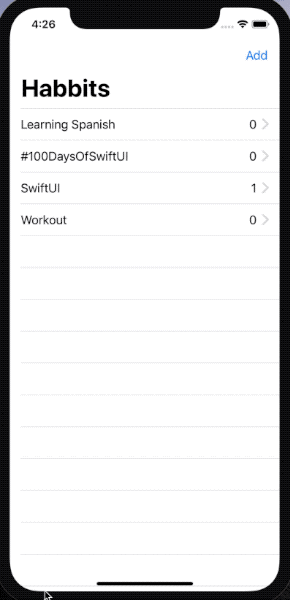

# Habbits

## Day 47
> Before we move on to our next batch of projects, you have a fresh challenge to complete. This means building a complete app from scratch by yourself, using the skills you’ve acquired over the previous three projects.
> This time your goal is to build a habit-tracking app, for folks who want to keep track of how much they do certain things. That might be learning a language, practicing an instrument, exercising, or whatever – they get to decide which activities they add, and track it however they want.
> At the very least, this means there should be a list of all activities they want to track, plus a form to add new activities – a title and description should be enough.
> For a bigger challenge, tapping one of the activities should show a detail screen with the description, how many times they have completed it, plus a button incrementing their completion count.
> For an even bigger challenge, use Codable and UserDefaults to load and save all your data.

### Class over Struct
As I needed to pass one of the habbit items from the List (by tapping one of the rows) to another View - and modify one of the properties (number of completions), I decided to define the Habbit item as a class instead of a struct.

### @Published & Codable
Everything was working nice and dandy until I had to make Habbit conform to Codable (to save & load from UserDefaults). It looks like having a property use @Published forces to implement the whole Codable requirements: CodingKeys, init(from decoder) & encode(to encoder).

### item.completions won't update itself inside the ForEach() view
I have to come back to this later when I understand how data flows in SwiftUI better. 